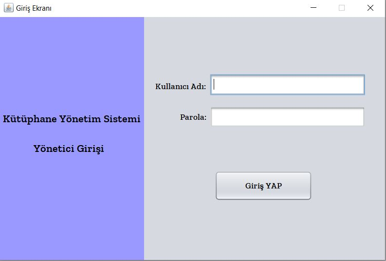
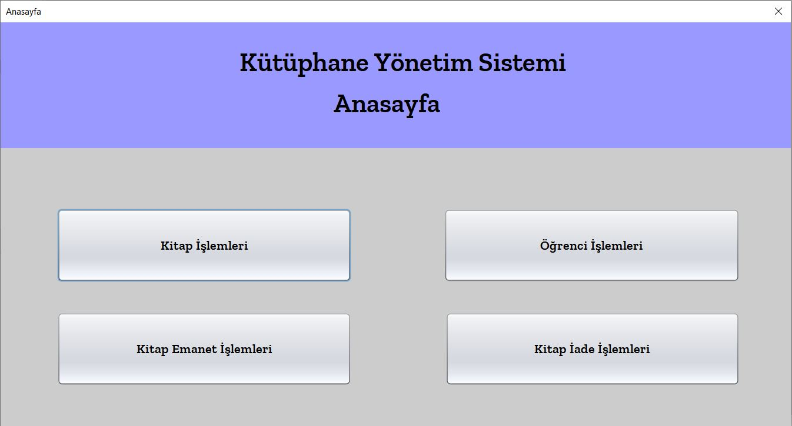
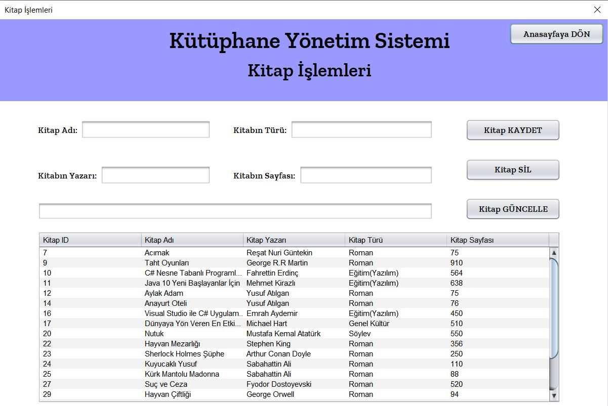
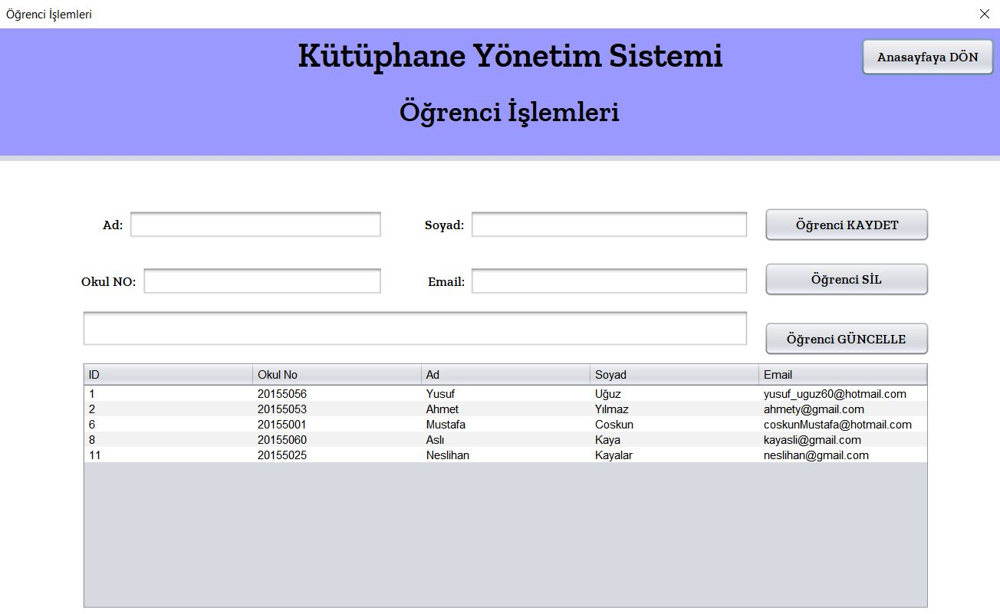
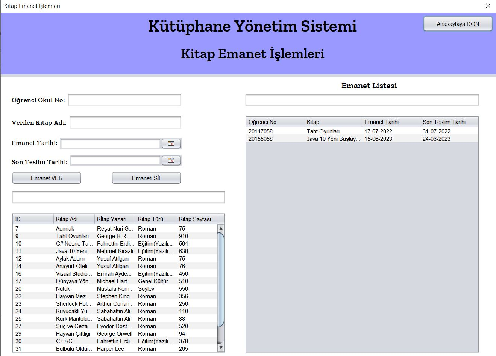
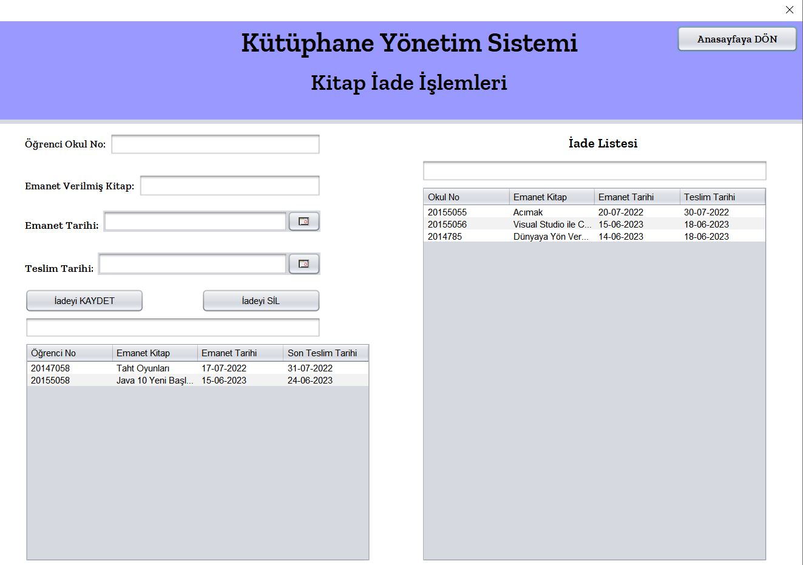

Basit tasarımlı ve işlevli bir kütüphane otomasyonu.
Kitap kaydı,öğrenci kaydı,kitap emanet verme ve kitap iade işlemleri başarılı bir şekilde yapılıyor.
Apache platformunda Java Swing kullanılarak ve database olarak mySQL kullanılarak bir windows uygulaması şeklinde oluşturuldu.
Created by YusufUguz

A library automation with simple design and functionality.
Book registration, student registration, book escrow and book return transactions are carried out successfully.
It's created as a windows desktop application using Java Swing on Apache platform and using MySQL as database.
Created by YusufUguz

Giriş Ekranı/Login Page 
 
Anasayfa/Home 
 
Kitap İşlemleri Ekranı/Book Registration 
 
Öğrenci İşlemleri Ekranı/Student Registration 
 
Emanet İşlemleri Ekranı/Book entrust 
 
İade İşlemleri Ekranı/Book Return 

